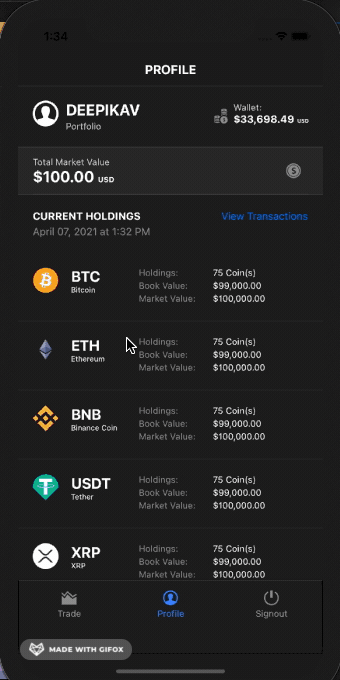

## Table of contents
* [General info](#general-info)
* [Technologies](#technologies)
* [Setup](#setup)

## General info
This project is a mobile mock trading app that allows users to “Buy” and “Sell” crypto currency coins within a fake “Portfolio”.
	
## Technologies
Project is created with:
* Client: React Native
* Server: [Serverless] AWS Lambda, AWS API Gateway
* Database: MongoDB Cloud
* Authentication: AWS Cognito + MongoDB
* API to get coin data: coingecko

## Setup
To run this project, install it locally using npm:
First of all, create a copy of AWSconfig_sample.js in client folder and rename it to AWSconfig.js. Add the required aws credentitals.

```
$ cd client
$ npm install
$ expo start
```

## Mockups


## Demo

