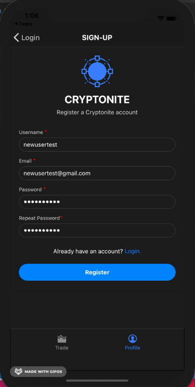
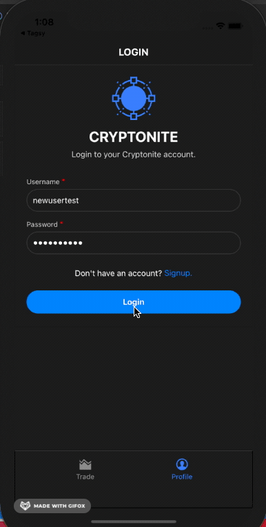
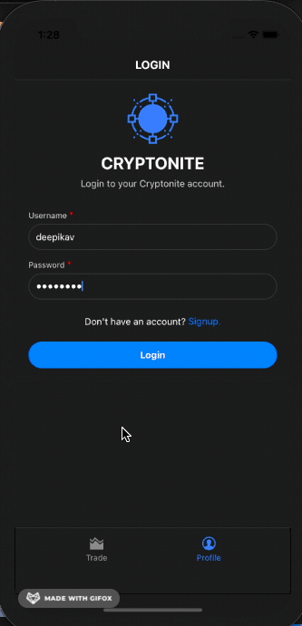

## Table of contents
* [General info](#general-info)
* [Technologies](#technologies)
* [Setup](#setup)
* [Mockups](#mockups)
* [Demo](#demo)

## General info
This project is a mobile mock trading app that allows users to “Buy” and “Sell” crypto currency coins within a fake “Portfolio”.
	
## Technologies
Project is created with:
* Client: React Native
* Server: [Serverless] AWS Lambda, AWS API Gateway
* Database: MongoDB Cloud
* Authentication: AWS Cognito + MongoDB
* API to get coin data: coingecko

## Setup

### Client
To run this project, install it locally using npm:
First of all, create a copy of AWSconfig_sample.js in client folder and rename it to AWSconfig.js. Add the required aws credentitals.

```
$ cd client
$ npm install
$ expo start
```

### Server

#### AWS Lambda
All the lambda function dependencies are configured in the `mongoLayer` and `geckoLayer` layers. Mongolayer is a required dependency for every function, while `geckoLayer` is required only for the cryptoPortfolioPositions, cryptoniteBuyCoin and cryptoniteSellCoin functions.

Each one of the functions in the nodejs directory should be deployed to AWS lambda as a separate function. The configuration script used to set up the environmental variables and the layers is the following:

```
aws lambda update-function-configuration --region us-west-2 --function-name FUNCTIONNAME --layers "arn:aws:lambda:us-west-2:ID:layer:mongoLayer:5" --environment Variables="{AWS_PASSWORD=PASSWORD, AWS_URL=URL, AWS_USERNAME=USERNAME}"
```

The AWS_PASSWORD, AWS_USERNAME and AWS_URL variables are the values of the mongo server used. For the demo application a free tier of MongoDB atlas was used. The layers parameter receives the ARN of the layers used with that function.

#### User Pool

A cognito user pool is configured for this application. An App client id has to be configured for the client application. All the other settings can be the default.

#### API Gateway

Every route in the API is using a cognito user pool Authorizer, configured to use the user pool created in the previous step. The token source should be called `Authorization`

The routes defined for this application are:

- POST /buy/{coin+} connected to cryptoniteBuyCoin
- POST /sell/{coin+} connected to cryptoniteSellCoin
- GET /user connected to cryptoniteGetUser
- GET /user/portfolio connected to cryptoPortfolioPositions

## Mockups


## Demo

### SearchScreen


### Register


### Sign in and Sign out


### Buy Coins


### Sell Coins


### Transaction History



